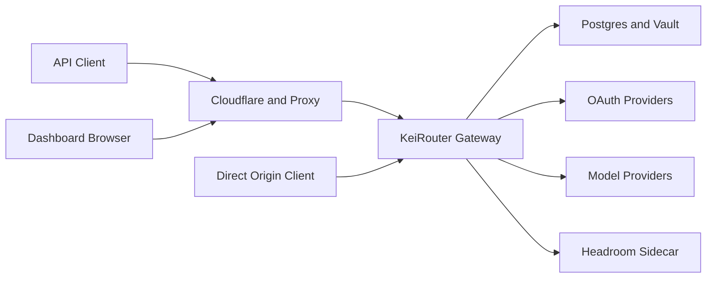

# KeiRouter Threat Model

## Executive summary

KeiRouter is a self-hosted, single-operator AI gateway that accepts API-key-authenticated requests, routes them to configured providers, and exposes a password-and-session-protected dashboard. The principal risks are origin exposure that bypasses Cloudflare, administrative compromise, provider credential loss, and policy bypass across protocol-specific gateway paths. The production hostname is Cloudflare-fronted, but the origin IP is reachable, so Cloudflare must not be treated as the only security boundary.

## Scope and assumptions

- **In scope:** the Go gateway, dashboard/admin routes, API-key routing, OAuth and encrypted credential storage, provider/proxy configuration, request parsing, and Coolify deployment configuration.
- **Evidence anchors:** `backend/internal/gateway/server.go` (`routes`), `backend/internal/gateway/middleware.go` (`authMiddleware`, `loopbackOnly`), `backend/internal/auth/auth.go`, `backend/internal/vault/vault.go`, `compose.coolify-postgres.yaml`.
- **Out of scope:** provider infrastructure, Cloudflare account configuration, the Coolify host firewall, operating-system hardening, and dynamic testing of the deployed instance.
- **Confirmed context:** one trusted operator; no PII is expected in prompts, responses, or logs; the production hostname is behind Cloudflare and a proxy; the origin IP remains directly reachable.
- **Assumptions:** the Coolify service uses the supplied template with a localhost-only host port; a strong dashboard password has replaced the first-run value; provider credentials have billing and account-access value even though application data is not regulated.

Open questions that change ranking: whether the origin firewall accepts only the Coolify/Cloudflare proxy path; whether direct-IP HTTP is reachable; and whether the first-run dashboard password was changed.

## System model

### Primary components

- **Gateway and API edge:** Go/Chi server exposes OpenAI-, Anthropic-, Gemini-, and media-compatible API paths; `routes` applies API-key authentication to `/v1` and `/v1beta` inference paths.
- **Dashboard and admin API:** password login mints HMAC-signed sessions; `/api` combines session middleware with the configurable loopback guard.
- **Routing pipeline:** resolves aliases/chains, applies model access rules, rate/budget limits, token-saving transforms, and provider dispatch. `handleChat` is the common OpenAI/Anthropic path; media has `mediaOptions`.
- **Credential and state store:** PostgreSQL in the Coolify template holds routing, key, usage, and account state. `vault.Vault` encrypts API, access, and refresh-token fields with an envelope master key.
- **External services:** OAuth identity providers, model providers, optional proxy pools, Cloudflare/Coolify ingress, and a private Headroom compression sidecar.
- **Runtime/development separation:** this model covers runtime paths. Tests, local Vite development, Docker builds, and GitHub workflow metadata are not runtime trust boundaries.

### Data flows and trust boundaries

- **Internet → Cloudflare/proxy → gateway:** API keys, dashboard credentials, prompts, and responses cross HTTPS at the intended hostname. The gateway trusts forwarded HTTPS headers for Secure-cookie behavior (`SecurityConfig.TrustForwardedHeaders`). Direct origin-IP access bypasses Cloudflare controls and must be restricted at the proxy/firewall.
- **API client → authenticated inference handlers:** bearer or `x-api-key` credentials cross HTTP into `authMiddleware`; handlers parse JSON or multipart payloads, then resolve models and enforce per-key policy on standard chat/media paths.
- **Dashboard browser → `/api` administration:** password login creates a signed session; session middleware and `loopbackOnly` protect account, provider, routing, backup, and tunnel controls. `BindLoopbackOnly=false` intentionally permits proxy-hosted dashboard use.
- **Gateway → PostgreSQL/vault:** encrypted provider tokens and keys, routing state, budgets, usage, and logs cross the application/store boundary. The Coolify template requires a production master key and DSN.
- **Gateway → OAuth/provider/proxy endpoints:** prompts, model responses, OAuth codes/tokens, and provider credentials leave the gateway over HTTPS. URL validators constrain configured outbound destinations; private base URLs are off by default.
- **Gateway → Headroom:** prompt content crosses a private Compose network to an unexposed sidecar. The sidecar has no host port in `compose.coolify-postgres.yaml` but retains outbound access for model downloads.

#### Diagram

## Assets and security objectives

| Asset | Why it matters | Security objective (C/I/A) |
| --- | --- | --- |
| Dashboard password and session signing key | Controls provider accounts, routing, exports, and tunnels | C/I |
| API keys, plans, and budgets | Authorize consumption and constrain spend/model access | C/I/A |
| Provider API keys and OAuth tokens | Permit model use and may incur billing or reveal account access | C/I |
| Master key and encrypted account records | Protect persisted provider secrets | C/I |
| Routing, aliases, and proxy settings | Determine where prompts and credentials are sent | I/C |
| Prompts and responses | Proprietary working context may be present despite no PII | C/I |
| Gateway, PostgreSQL, and Headroom capacity | Availability is required for the sole operator’s tooling | A |
| Usage, console, and metrics telemetry | Reveals operational activity, providers, models, and spend | C |

## Attacker model

### Capabilities

- Remote unauthenticated attacker who can reach the public hostname or direct origin IP.
- Holder of a leaked API key or shared portal URL.
- Network-path attacker only on a direct, non-TLS origin connection; not on normal Cloudflare HTTPS traffic.
- Reader of a compromised database backup, portable export, or host volume.
- Authenticated API-key holder able to submit arbitrary supported request payloads, including multipart audio.

### Non-capabilities

- No assumed trusted-team or cross-tenant adversary: the deployment has one operator.
- No assumed PII or regulated-data exposure.
- No assumed compromise of Cloudflare, Coolify, model providers, the host OS, or the master key unless a separate boundary is breached.
- No assumed arbitrary access to private provider URLs while `allow_private_base_url` remains false.

## Entry points and attack surfaces

| Surface | How reached | Trust boundary | Notes | Evidence |
| --- | --- | --- | --- | --- |
| Inference API | `/v1/*`, `/v1beta/*` | API client → gateway | API-key middleware, concurrency control, JSON/multipart parsing | `backend/internal/gateway/server.go` `routes`; `middleware.go` `authMiddleware` |
| Dashboard login/admin | `/api/auth/*`, `/api/*` | browser/proxy → gateway | Login rate limit, session middleware, configurable loopback guard | `server.go` `routes`; `auth_handlers.go` `handleLogin` |
| OAuth callbacks | `/oauth/callback`, `/auth/callback`, Kimchi callback | external IdP → gateway | State/PKCE flow; callback works without dashboard session | `backend/internal/gateway/server.go`; `gateway/oauth.go` |
| Usage portal | `/v1/portal/keys/{id}/usage` | anonymous caller → gateway | Public by design; identifier functions as a capability | `backend/internal/gateway/server.go`; `gateway/handlers.go` `handlePortalKeyUsage` |
| Multipart transcription | `/v1/audio/transcriptions` | API client → gateway/filesystem | Multipart parsing and temporary-file spooling precede later audio read limit | `backend/internal/gateway/media.go` `handleAudioTranscription` |
| Admin-configured egress | provider accounts and proxy pools | dashboard admin → provider/proxy | URL validation blocks dangerous destination classes by default | `gateway/admin.go` `validateProxyPoolURL`; `config` `AllowPrivateBaseURL` |
| Metrics and health | `/metrics`, `/healthz`, `/v1` | remote caller → gateway | Metrics rely on the loopback setting; health/version are public | `backend/internal/gateway/server.go` `routes` |

## Top abuse paths

1. **Origin administration compromise:** an attacker reaches the origin directly, bypasses Cloudflare controls, and uses a unchanged first-run password or intercepted direct-HTTP session to administer providers, exports, tunnels, and keys.
2. **Protocol-policy bypass:** a leaked/restricted API key invokes Gemini-native generation; the handler resolves and dispatches a target without the standard model filtering and effective-limit derivation, consuming a forbidden model or budget.
3. **Credential theft through persistence:** host, PostgreSQL backup, or portable export access reveals provider secrets; encrypted token fields reduce impact, but provider-specific secret material stored in plaintext metadata increases it for affected integrations.
4. **Disk exhaustion through audio uploads:** an API key submits very large multipart transcription requests; multipart parsing spools to disk before the later stream read cap limits the consumed audio.
5. **Cloudflare bypass telemetry disclosure:** a direct-origin caller reaches `/metrics` when loopback-only protection is disabled and learns model/provider, cost, and guardrail operational data.
6. **Portal capability disclosure:** a shared or leaked portal identifier exposes one operator’s key-related usage/budget information without a revocation/expiry control.
7. **Post-admin SSRF/prompt exfiltration:** after dashboard compromise, an attacker changes provider base URLs or proxy pools to route prompts/credentials to an attacker-controlled service; validators reduce dangerous target classes, but admin configuration is high privilege.

## Threat model table

| Threat ID | Threat source | Prerequisites | Threat action | Impact | Impacted assets | Existing controls (evidence) | Gaps | Recommended mitigations | Detection ideas | Likelihood | Impact severity | Priority |
| --- | --- | --- | --- | --- | --- | --- | --- | --- | --- | --- | --- | --- |
| TM-001 | Remote origin-IP attacker | Origin listener/firewall permits a path; default password is unchanged or direct HTTP is usable | Bypass Cloudflare and authenticate/steal an admin session | Full administrative control | Dashboard, keys, providers, routing, exports | Session middleware, login rate limiter, password hashing; `server.go`, `auth.go` | Remote proxy mode disables loopback; first-run credential is predictable; direct origin policy is unverified. Deployment split: the Coolify template binds its host port to `127.0.0.1` (`compose.coolify-postgres.yaml:13`) so the origin is not directly exposed there; the all-interface port in the default `compose.yaml` (with `BIND_LOOPBACK_ONLY:-false` overriding the safe code default at `config.go:311`) is the exposed variant | Firewall origin to Coolify/proxy only; enforce TLS at origin; require explicit initial password for non-loopback; alert on default-password state | Alert on direct-IP requests, login failures/successes, password reset, and admin configuration changes | Medium | High | high |
| TM-002 | Leaked or constrained API-key holder | Valid key and Gemini-compatible request | Use Gemini-native endpoint to bypass target filtering/effective limits | Unauthorized model/spend use | API-key policy, budget, provider accounts | Standard chat and media paths call `filterAllowedTargets` and `effectiveLimits` (chat: `handlers.go:226,261`; media: `mediaOptions` at `media.go:31,40`); Gemini body reads are capped via `readRequestBody` (`handlers.go:39-41`) | Gemini-only gap: `handleGeminiGenerate` (`gemini.go:26-101`) resolves/dispatches without parity controls | Apply both controls before Gemini dispatch; parity tests for all API dialects | Record key, dialect, resolved target, denial reason, and budget decision | High | High | high |
| TM-003 | Backup/host-volume attacker | Database/export or volume access | Recover provider secret material from account state | Provider account misuse and spend | OAuth/API credentials, billing | `vault.Seal` encrypts API, access, and refresh tokens; Coolify requires master key | Metadata is JSON serialized; provider-specific credentials must never be placed there | Move secret metadata into sealed fields; redact exports; restrict backups and rotate affected credentials | Audit exports/backups and flag metadata keys matching secret patterns | Low | High | medium |
| TM-004 | Authenticated API-key holder | A valid key; storage available | Upload oversized multipart audio to force temporary-file spooling | Gateway/host availability loss | Disk and service availability | Per-request concurrency limit; later `io.LimitReader` | No `MaxBytesReader` before `ParseMultipartForm` (`media.go:180` passes `requestBodyLimit()` as maxMemory — a RAM threshold, not a body cap) | Install hard body cap before multipart parsing, return 413, clean temporary files; set container disk quota | Monitor temp-space, request size, 413s, and transcription latency | Medium | Medium | medium |
| TM-005 | Remote origin-IP caller | `BindLoopbackOnly=false` and origin reachability | Request unauthenticated metrics directly | Operational intelligence disclosure | Telemetry, provider/model/spend metadata | Metrics route uses `loopbackOnly` (`server.go:278-283`; no-op at `middleware.go:76-79` when the flag is false) | In proxy deployment that guard intentionally passes requests; Cloudflare no longer encloses the origin. Applies to the default `compose.yaml` all-interface port; the Coolify template's loopback host port is not directly reachable | Bind metrics separately or require scraper auth; firewall origin; disable public metrics | Alert on non-scraper metrics access and direct-IP requests | Medium | Low | low |
| TM-006 | Portal-link recipient or referrer leak | Learns portal identifier | Fetch public portal usage endpoint | Budget/usage disclosure | Usage and key metadata | UUID-like key identifiers reduce blind guessing | Portal is unauthenticated and lacks explicit expiry/revocation/owner check | Use a separate scoped, expiring, revocable portal token; avoid URL identifier sharing | Log portal token use, geo/source, revocations, and unusual frequency | Low | Low | low |
| TM-007 | Dashboard/session attacker | Admin session compromise | Alter provider/proxy configuration to redirect outbound traffic | Prompt/credential exfiltration and routing integrity loss | Prompts, providers, routing, credentials | Admin route requires session; URL validators; `AllowPrivateBaseURL=false` by default | Single shared admin identity has broad configuration authority; public destinations remain valid | Harden origin/admin access; require re-authentication for egress changes; allowlist provider hosts; audit changes | Immutable audit trail and alerts for base URL/proxy/chain changes | Low | High | medium |

## Criticality calibration

- **critical:** immediate, broadly exploitable full control or secret extraction without a material additional precondition. Examples: an origin exposed with the unchanged first-run dashboard password; a pre-auth remote-code execution in a gateway parser; leakage of the master key plus account database.
- **high:** realistic compromise of gateway policy, provider accounts, or operator control after one common precondition. Examples: Gemini API-key policy bypass (TM-002); direct-origin dashboard compromise when origin firewall/TLS is absent (TM-001); provider token theft from a host-volume breach.
- **medium:** a targeted attack with constrained impact or a meaningful prerequisite. Examples: multipart disk exhaustion (TM-004); egress configuration abuse after session compromise (TM-007); unsealed provider-specific secret metadata in a backup (TM-003).
- **low:** limited operational disclosure or a noisy, easily contained abuse path. Examples: direct metrics access (TM-005); leaked single-operator portal link (TM-006); static-file existence probing.

## Focus paths for security review

| Path | Why it matters | Related Threat IDs |
| --- | --- | --- |
| `compose.coolify-postgres.yaml` | Defines loopback host binding, proxy mode, master-key requirement, and network membership | TM-001, TM-005 |
| `backend/internal/gateway/server.go` | Central route grouping determines authentication and public/admin boundaries | TM-001, TM-005, TM-006 |
| `backend/internal/gateway/middleware.go` | API-key extraction/authentication and loopback enforcement | TM-001, TM-002, TM-005 |
| `backend/internal/auth/auth.go` | First-run password, session signing, TTL, and password reset semantics | TM-001 |
| `backend/internal/gateway/auth_handlers.go` | Login rate limiting and secure-cookie behavior behind proxies | TM-001 |
| `backend/internal/gateway/gemini.go` | Protocol-specific routing bypasses shared access/limit enforcement | TM-002 |
| `backend/internal/gateway/handlers.go` | Reference implementation for body limits, target filtering, and effective limits | TM-002, TM-004 |
| `backend/internal/gateway/media.go` | Multipart parsing and media authorization parity | TM-002, TM-004 |
| `backend/internal/vault/vault.go` | Envelope encryption boundary and plaintext metadata handling | TM-003 |
| `backend/internal/gateway/oauth.go` and `backend/internal/oauth/manager.go` | OAuth token/metadata persistence and refresh | TM-003 |
| `backend/internal/gateway/admin.go` | High-privilege configuration, backup/export, and proxy-pool management | TM-003, TM-007 |
| `backend/internal/httputil/` | Outbound URL validation and SSRF controls | TM-007 |

## Notes on use

- **Quality check:** covered discovered public, API-key, dashboard, OAuth, upload, portal, metrics, and admin-egress entry points; each material boundary appears in at least one abuse path; runtime behavior is separated from development/CI; the user-confirmed single-operator/no-PII/Cloudflare-plus-direct-origin context is incorporated.
- **Re-verification 2026-09-09:** the model was re-validated line-by-line against HEAD `39e9f15` (`39e9f15347ea3b5d9d3a304e3b0489e49a864538`, two commits after the original scan revision `4bd79c2`). All TM-001…TM-007 gaps remain open; evidence anchors in this document reflect current line numbers (`gemini.go:26-101`, `handlers.go:39-41,226,261`, `media.go:23-49,180,195`, `server.go:278-283,330,379-389`, `middleware.go:74-88`, `auth_handlers.go:130-155`, `kiro.go:141-145`, `oauth.go:499-512`, `vault.go:72-78`, `config.go:311`). Companion findings detail: `doc-003`.
- This is a source-grounded model, not evidence that the live firewall, Cloudflare origin policy, TLS termination, or password state has the assumed configuration. Validate those deployment controls before closing TM-001 and TM-005.
